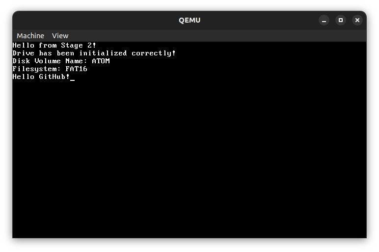

<picture>
  <source media="(prefers-color-scheme: light)" srcset="https://raw.githubusercontent.com/cakehonolulu/atom/main/resources/logo_light.png">
  <source media="(prefers-color-scheme: dark)" srcset="https://raw.githubusercontent.com/cakehonolulu/atom/main/resources/logo_dark.png">
  
</picture>

<h2 align="center">A simple, i386 2-stage bootloader written in C</h2>

## ✨ Features
* MBR support
* FAT16 File Loading (In Stage 1)
* Simple ATAPIO 24-bit disk driver
* Built with ❤️ for i386

  

## 👷🏼‍♂️ Roadmap
* Stage-2 Protected Mode FAT16 kernel chainloading (Inside Stage 2)
* Documentation
